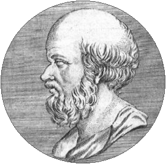

# Eratosthenes

Online book catalogue so my dad can

*   track what he owns
*   quickly determine which books he is missing from a series
*   work out where he's stored them

Other features available by request.

# Etymology

There are three complementary reasons for choosing the name Eratosthenes.

1.  To remind my dad that cheats never prosper after stealing my answer to this
    crossword clue

    > So earnest, the silly old astronomer (12) [Times Jumbo 396, March 30
    > 2002]

    and attempting to take full credit for it.

2.  There's a certain resemblance between Eratosthenes and my dad.

    

3.  Fortuitously, Eratosthenes also happened to be the chief librarian at the
    Library of Alexandria.
